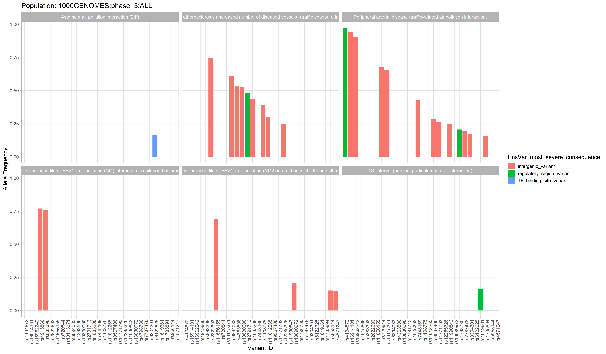

<!-- README.md is generated from README.Rmd. DON'T EDIT README.md FILE-->

```{r setup, include=FALSE}
knitr::opts_chunk$set(echo = TRUE)
```

# GWASpops.pheno2geno


## Overview

The [GWAS catalog](https://www.ebi.ac.uk/gwas/) (Genome Wide Association Study) is a publicly accessible repository containing thousands of curated data sets from GWA studies. This package aims to extend its usefulness to researchers interested in connecting phenotypes of interest to genotypes of specific populations.

By integrating population allele frequency data from studies such as The 1000 Genomes Project with GWAS data, phenotypes/traits of interest which are associated with specific variants/SNPs can be investigated with respect to populations. The population data is not complete (with respect to all of humanity and all significant sub-populations), but draws from various genomic studies which have been aggregated by [Ensembl](https://useast.ensembl.org/info/genome/variation/species/populations.html).

With this R package, a researcher can grab data from the GWAS catalog, and use that data to grab [variant-ID](https://www.ebi.ac.uk/training/online/courses/human-genetic-variation-introduction/variant-identification-and-analysis/variant-identifiers/) associated annotations and population-genetics data which is all integrated together into flat tables. Further, the tables can be used to generate graphs in order to explore the connection between population-specific allele frequencies and alleles associated with a trait of interest. Tables can also be exported for other purposes as well. 


## Installation

This package can be installed using the devtools function `install_github()` 
```
# Copy this code into your R console in order to download the package. 
devtools::install_github("J-T-Nelson/GWASpops.pheno2geno")
```

## Tutorial

A full [tutorial](https://github.com/J-T-Nelson/GWASpops.pheno2geno/blob/main/man/GWASpops.pheno2geno.md) which explains how this package is intended to be used. The basic workflow needed requires some data retrieval outside of R, thus it is suggested to at least skim the document before attempting to use the package!

## Example Data

Example data is available in the `exampleData/air_pollution` folder which has been used to generate the example plots below. 

New users may find this data helpful for learning the various functions in this package, as this data has been persistently used throughout package development and thus is guaranteed to play nicely with all package functions. This very same data was used to create some of the data objects which are included in the package. (More on those data objects in the [tutorial](https://github.com/J-T-Nelson/GWASpops.pheno2geno/blob/main/man/GWASpops.pheno2geno.md)) 

Additional data is also available in `exampleData/transformed_data_for_graphing`, which has already been run through the data retrieval and transformation function of the pipeline (`createMT()`). This data can also be downloaded and used to experiment with pipeline functionality before getting started with your own novel data sets. 

The data can be downloaded directly from github with the help of a community driven web-app: [download-directly.github.io](download-directly.github.io).

Simply go to this website and enter the Github URL of the folder you wish to download: *https://github.com/J-T-Nelson/GWASpops.pheno2geno/tree/main/exampleData/air_pollution*

## Example Plots





## Getting Help

If you encounter a bug with the package, have feature requests or wish to discuss this package contact Tanner Nelson at *jon.tanner.nelson@temple.edu*. Also see the 'Known Errors and Limitations' section of the [tutorial](https://github.com/J-T-Nelson/GWASpops.pheno2geno/blob/main/man/GWASpops.pheno2geno.md) document to see if I have already encountered and offered advice on an issue or error you run into. 

