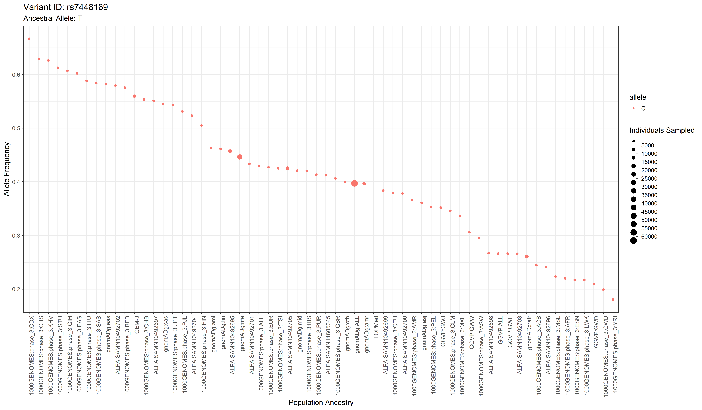
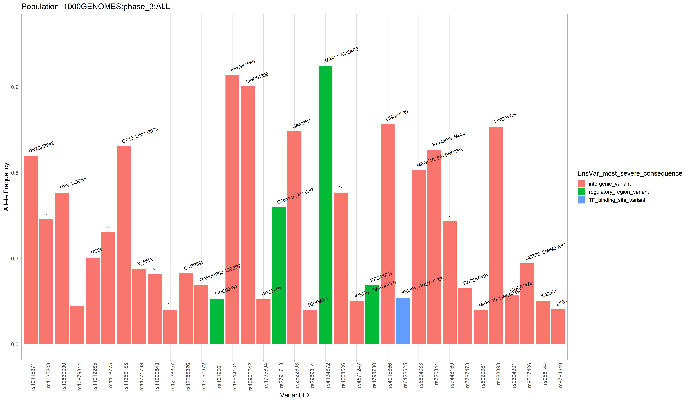
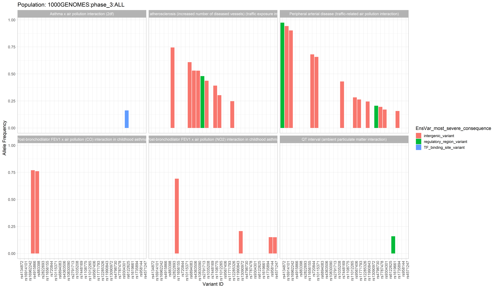
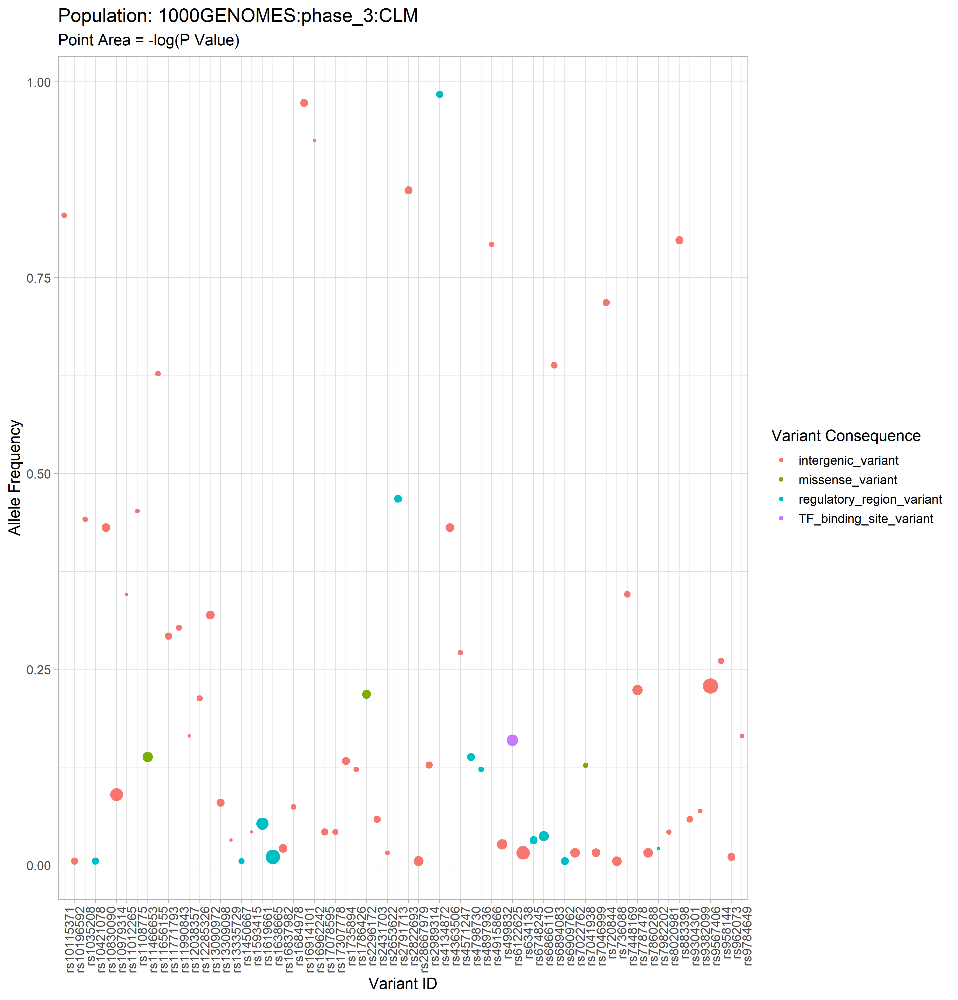

<!-- README.md is generated from README.Rmd. DON'T EDIT README.md FILE-->

# GWASpops.pheno2geno

## Overview

The [GWAS catalog](https://www.ebi.ac.uk/gwas/) (Genome Wide Association
Study) is a publically accessible repository of thousands of curated
data sets from GWA studies. This package aims to extend its usefulness
to researchers interested in connecting phenotypes of interest to
genotypes of specific populations.

By integrating population allele frequency data from studies such as The
1000 Genomes Project with GWAS data, phenotypes–traits–of interest which
are associated with specific variants–SNPs–can be investigated with
respect to populations. The population data is not complete (with
respect to all of humanity and all significant sub-populations), but
draws from various genomic studies which have been aggregated on
[Ensembl](https://useast.ensembl.org/info/genome/variation/species/populations.html).

With this R package, a researcher can grab data from the GWAS catalog,
and use that data to generate graphs and tables in order to explore the
connection between population allele frequencies and alleles associated
with a trait of interest.

## Installation

This package can be installed using the devtools function
`install_github()`

    # Copy this code into your R console in order to download the package. 
    devtools::install_github("J-T-Nelson/GWASpops.pheno2geno")

## Tutorial and Vignettes

TODO: Write tutorial and Vignettes, nest them into the github repo, link
to them in this section. TODO: display a graph example image in this
section to help give an early impression of what this package is capable
of!

##### Example Data

There is example data available in the “air_pollution” folder which has
been used to generate the example plots below. New users may find this
data helpful for learning the various functions in this package, as this
data has been persistently used throughout package development and thus
is guaranteed to play nicely with all package functions.

The data can be downloaded directly from github with the help of a
community driven web-app:
[download-directly.github.io](download-directly.github.io).

Simply go to this website and enter the Github URL of the folder you
wish to download:
*<https://github.com/J-T-Nelson/GWASpops.pheno2geno/tree/main/exampleData/air_pollution>*

## Example Plots

## Getting Help

If you encounter a bug with the package, have feature requests or wish
to discuss this package contact Tanner at
*<jon.tanner.nelson@temple.edu>*
