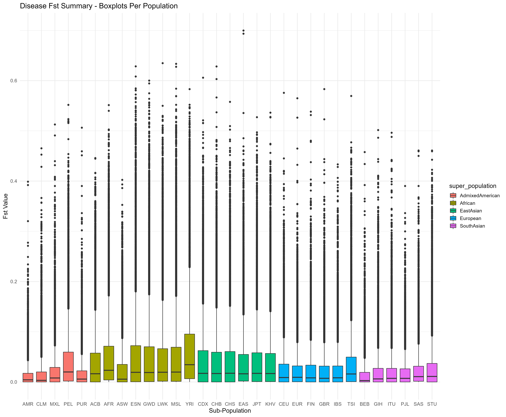
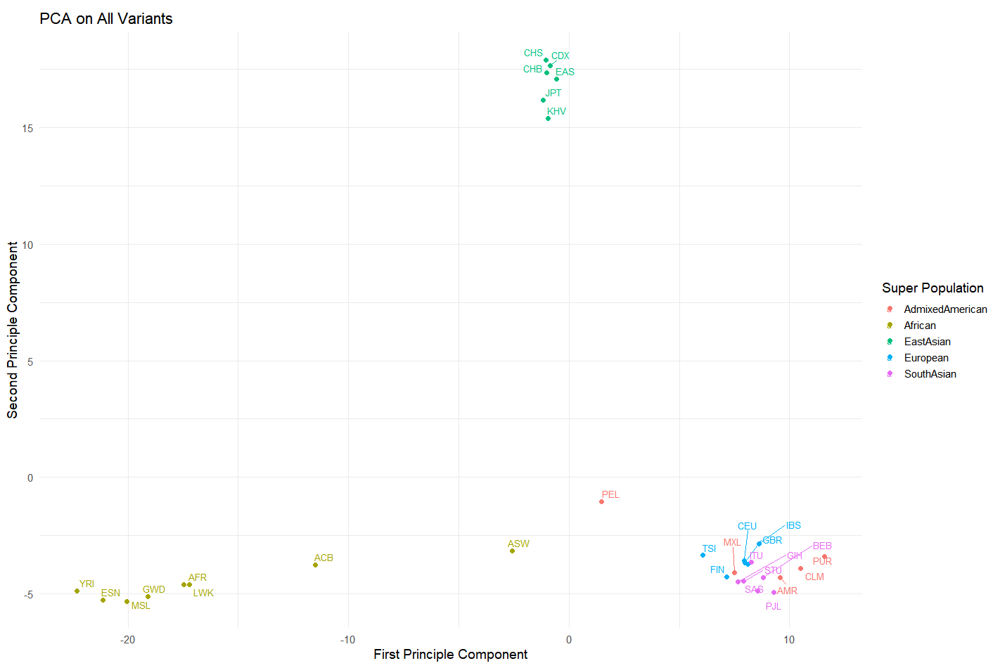
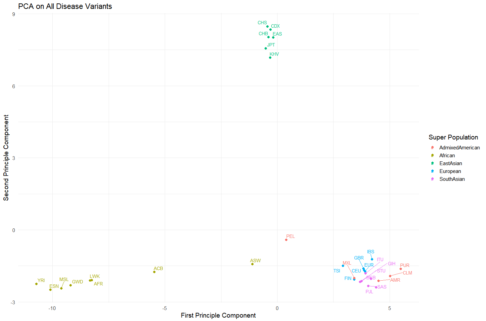
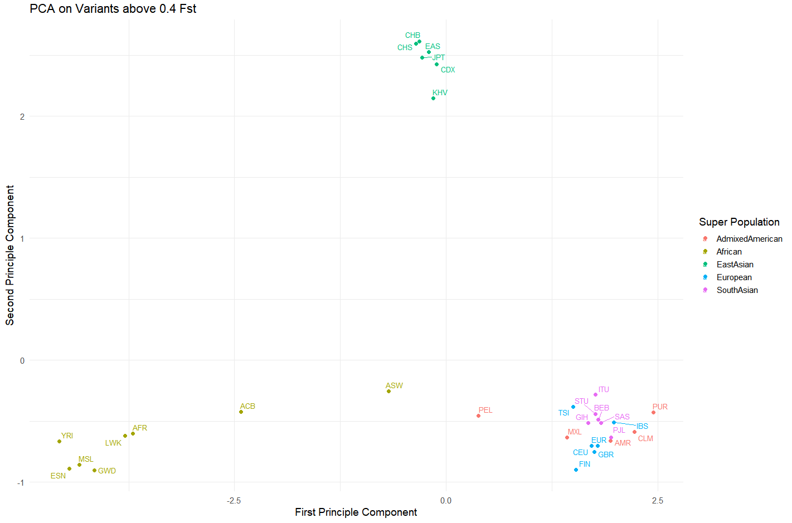
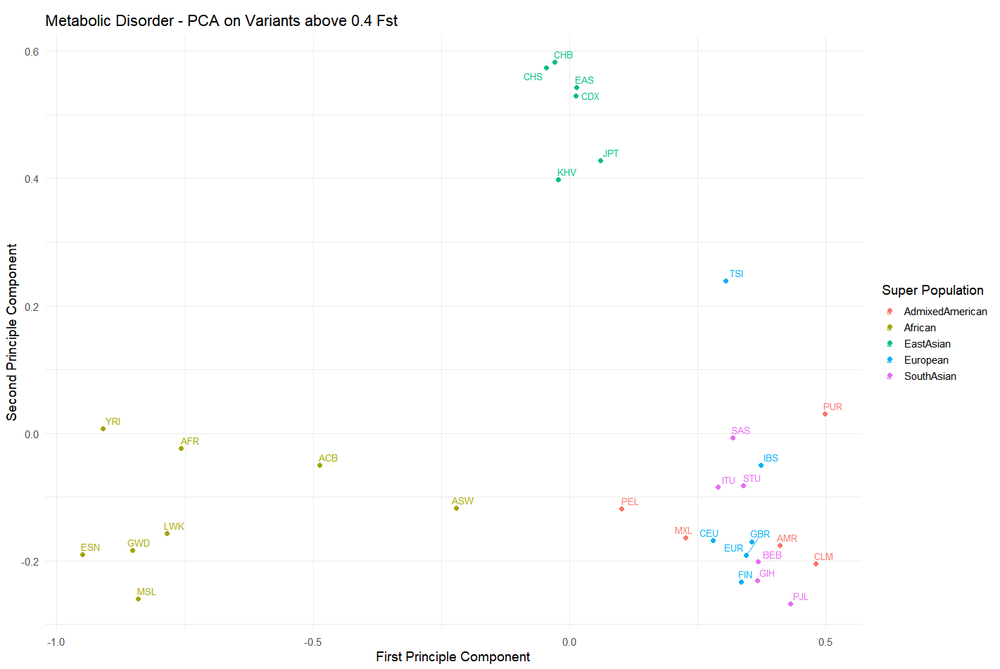

## Introduction

With the dawn of large public genomic/genetic data sets following the growth of genomics as a field, opportunity for novel data analyses and novel scientific insights through purely data focused approaches has become possible. Resources such as the [International Genome Sample Resource](https://www.internationalgenome.org/) (IGSR), and the [GWAS Catalog](https://www.ebi.ac.uk/gwas/) are exemplary resources supporting a data centric approach in scientific investigation. 

In this project these two data resources have been primary drivers in the investigation of two genetics focused questions:

1. Are there genes involved in human disease phenotypes harboring population specific SNPs? 
2. Do diseases containing population specific SNPs show significant prevalence disparities between those populations?

These questions aim to build a better understanding of genetic differences between diverse populations through the analysis of disease associated mutations. Further a natural follow up to finding highly differentiated SNPs is to begin to ask what affects those differences may have within populations broadly. 


## Methods

The methods section will be devoted to key technical steps taken throughout this analysis, where first I will outline the major actions that define the work, and then I will describe the necessary decisions made throughout the process which potentially impact end results along with more detailed working steps and tools used throughout. 

All technical work, including data retrieval via API request, data visualization, data fixing, reformatting and further manipulation was performed within R using RStudio. Details on packages and versions used can be found within the supplementary materials document. Further details regarding the projects process can also be found within the supplementary materials, where links to reports on the projects progress on a bi-weekly basis outline some of the major technical steps in greater detail than I will go over here. 


### Major Technical Steps 

*The major technical steps are listed in chronological order, and were not necessarily performed in an optimal order. The chronological order has been preserved in order to accurately capture the process and results of this project.*

1. Download [association data](https://www.ebi.ac.uk/gwas/docs/file-downloads) from the GWAS Catalog
2. Use unique SNP-IDs (e.g., rs0000000) to request population data from [Ensembl REST API](https://rest.ensembl.org/)
3. Transform population data into appropriate R data structures
4. Develop Fst (fixation index) calculation code tools, then calculate Fst for all SNPs across all 1000 Genomes populations
5. Download [Experimental Factor Ontology](https://www.ebi.ac.uk/gwas/docs/file-downloads) (EFO) to broadly categorize SNPs
      - Divide SNP set into disease and non-disease categories using `parent terms` from the EFO table
6. Clustering analysis using PCA
7. Table generation - top SNPs in monogenic and all-disease categories according to their Fst scores against the total population `1000GENOMES...ALL` selected and tabulated with other key data features 
      - Tables can be found in the "Tables" section of the supplementary materials
8. Search for and download disease prevalence data for diseases with significant representation in high Fst SNP sets (monogenic and all-diseases)
9. Visualize and tabulate correlation between SNP frequency and disease prevalence for disease and populations with sufficient data representation


### Technical Decisions & Details 

*Specific Major Technical Steps will be referenced by number throughout this section*

#### 2. 

Unique SNP ids were found by using `base::unique()` on the full set found within the associations table downloaded from the GWAS Catalog. Data was requested using novel modifications of code developed for a package associated with this project (["GWASpops.pheno2geno"](https://github.com/J-T-Nelson/GWASpops.pheno2geno)). The [Variation - POST variation/:species/](https://rest.ensembl.org/documentation/info/variation_post) endpoint from Ensembl was used to retrieve populations data. 

During retrieval of data via this API several challenges arose due to inconsistent API responses and slow data transfer rates. Details on code used as well as issues encountered are documented in "fstCalculation_data_Retrieval.html" within this repository. Due to the issues which arose in using Ensembl's REST API, I would suggest anyone wishing to use 1000 Genomes data for similar analyses rely on data directly pulled from their FTP servers or other more reliable sources. To describe the issues which made Ensembl's API undesirable for the large scale analysis performed in brief: 1. Data transfer is quite slow; a full 80+ hours of active transfer time was required to grab all populations and variation data for ~250k unique SNP ids. 2. Data transfer was unreliable when requesting larger volumes per request, that is, data which was known to exist on their servers would fail to transfer for unknown reasons, which presented technical challenges that were unnecessary. 3. Populations data on SNPs of interest may be preprocessed in undesirable forms from this resource, while raw data from IGSR is not preprocessed.  

Due to the inconsistency of data retrieval I was unable to retrieve population data for all unique SNPs. A key reason which made quality control of data retrieval challenging was the silent mode of failure. Where the API request would be successfully received, but empty replies without any error registering would be sent back. In this analysis 249,792 unique SNPs from the GWAS Catalog were narrowed down to 209,455. A large portion of these missing values are due to failed API requests, while some others are due to another quirk of the API where SNP ids which are synonyms return a single id in the response. *An example of two synonymous SNPs are "rs10919928" and "rs113957544; Upon searching Ensemble for each you will find both return rs10919928 as the single result"*

#### 3. 

Ensembl data consists of variant annotations (SNP annotations) and population data associated with those SNPs. When requested from Ensembl's API the data does not come in formats which are natively usable in R. Packages such as `jsonlite` are necessary to convert the JSON data into R list data structures. After the data is in a list format, in order to efficiently process the data and standardize its form, transformation of that data into a `data.frame` data structures is necessary. Some of the data does not easily flatten into the 2D shape of a `data.frame` (rows x columns), and thus must be stored in other formats such as a list of `data.frame`s. 

In short, transformation of loosely structured data into flexibly structured, standardized data is necessary to proceed with analyses. The task of transforming this data was challenging for me, and took a substantial amount of time, as many nuances existed within the large data set which prevented simple transformation from one form to another. Each nuance had to be accounted for somehow in the code responsible for transforming the data, which made for an involved code development process. 

#### 4. 

Fst estimation was achieved using the Hudson estimator proposed in "Estimating and interpreting FST: the impact of rare variants." Bhatia et al.. Fst calculation functions can be found within "Fst_funcs.R" within the "R" folder of this repo. 

Fst calculations are performed in order to estimate the degree of allele fixation within populations, and thus are core to answering the first question of this analysis. Some critical notes about the use of Fst as a statistic in this project are that Fst cannot be estimated between more than two populations at a time. Meaning that each Fst calculation is pairwise. Further, Fst estimations cannot be done on multi-allelic sites, where more than one variant (besides the ancestral allele) exists. This limitation of Fst further narrows the amount of usable SNPs within the data. 

Since the question motivating this project is related to population differentiating SNPs I made the decision to allow insertions and deletions to be considered as bi-allelic SNPs, as despite formal definitions of Fst suggesting that Fst could not be calculated in these cases, they are still important differentiating mutations which could act as population level markers for disease phenotypes. 

#### 5. 

Of the 17 total `parent terms` found within the EFO table 7 were selected as disease categories: 

1. Cancer
2. Cardiovascular Disease
3. Digestive System Disorder
4. Immune System Disorder
5. Metabolic Disorder
6. Neurological Disorder
7. Other Diseases

Though all SNPs assigned these parent terms are unlikely to perfectly capture all disease associated SNPs and and exclude all non-disease associated SNPs, this method of data portioning was most parsimonious of those considered.

#### 6.

Several different clustering analyses were performed using Fst values calculated for various subsets of the total set of SNPs which could have their Fst value determined. Each of 31 sub populations from the 1000 Genomes data set were used against the total population (an aggregation of all samples collected in the 1000 Genomes Study Phase 3 and before) in deriving all Fst values used for principle component analysis (PCA). 

PCA was performed using `stats::prcomp()` and the work performed for these analyses can be seen within the unedited (i.e. unstructured) "ClusteringAnalysis_1.R" script. The row-by-column observations and features fed into the PCA function are SNP ids-by-sub populations respectively. The values within are all Fst calculated for each SNP and subpopulation against the total population. 

#### 7. 

There are two tables as mentioned above. One for monogenic diseases, and one for all-diseases categories. Each table was made using top *n* SNPs per sub population, where top SNPs are determined by their ranking in terms of Fst against the total population. 

The monogenic table used the top 10 SNPs for each population resulting in a total of 93 unique SNPs due to overlap across populations. The all-disease table used the top 20 SNPs for each population and resulted in 300 unique SNPs. The numbers 10 and 20 were chosen somewhat arbitrarily, as they both were simple values which captured only high Fst SNPs but allowed for equal representation of SNPs for each population, as choosing cutoff values for top SNPs in terms of actual Fst values (for example 0.4 Fst and above) would result in some populations have many SNPs above some threshold, with other populations having no SNPs above that threshold. It was this relationship that motivated a n-per population cutoff for top SNPs in generating these tables. 

#### 8. 

References number 3-5 were the sources of disease prevalence data used. 

I wanted to get some representation for the top 10 monogenic diseases (found by counting the number of top SNPs associated with each disease) and thus was driven to find individual papers for cystic fibrosis as well as phenylketonuria as the key resource where top all-disease category diseases had their data sourced from unfortunately contained no monogenic disease data. This top resource being the Institute for Health Metrics and Evaluation (IHME). 

Different data sources resulted in variance within the data itself. Specifically the populations represented and where those populations were sampled from differed significantly within each source. Each data set was processed differentially in order to standardize the data formats for the prevalence vs allele frequency comparisons made in this analysis. An important step in standardization was mapping the populations sampled by the three different data sources onto the set of 31 sub populations from the 1000 genomes study. This mapping was performed manually for each data set, and in some cases there were many-to-one mappings which lead to further challenges in making meaningful allele-frequency vs disease-prevalence comparisons. When necessary to derive single values from many-to-one mappings in either prevalence or allele frequency, mean values of the set in consideration were used.   

All work done on standardizing these data into similar tables as well as analyzing them can be found within the "disease_prevalence_vs_snp_frequency.R" file. 


#### 9.

In order to make the comparison of disease prevalence to allele frequency for top SNPs according to their Fst ranking, I had to determine a method of meaningfully capturing all allele frequency data per population per disease. Since these top diseases were selected by counting occurrences of disease associated SNPs from the top SNP tables (monogenic and all-disease tables each), there inevitably were more then one SNP for each disease. By taking the mean allele frequency for each population per each disease a single number to single number comparison of mean-Fst to disease-prevalence could be made. 

Unfortunately there was some error in this mean calculation which is evident for the GBR sub population in graphs which will be shown later, which implies that these mean values are possibly errant for other categories as well. Due to time constraints I was unable to ameliorate these errors, however I still believe the analyses which were performed are worth consideration. 


## Results & Discussion

In order to address the question of whether population specific SNPs exist within disease-associated genes Fst has been used as a key metric indicating differentiation. All Fst values used within the following analyses are pairwise calculations between the total population and each of 31 sub populations. A set of box plots was created to capture the broad patterns of differentiation for each sub population below. 



It can be observed that each population has some outlying SNPs suggesting the presence of highly differentiating disease associated SNPs across the board. Further the general shape of each distribution tends to follow a common patten for each super population, which is a consistent pattern that appears in later analyses as well. Which is to say for sub populations within a shared super population there is a high degree of similarity, when compared to sub populations found within separate super populations. This pattern is especially evident when viewing a PCA clustering analysis on the entire set of SNPs and then narrowing down to the subset of disease associated SNPs and finally down to specific broad disease categories. 



Within the PCA performed on all ~160k SNPs with Fst values there are 3 clear clusters formed. One for the African sub populations, one for the East Asian, and finally a tightly packed cluster of the remaining three super populations. Within this tight cluster however, there is some significant degree of separation between each super population, as the European super population is leftmost, the Admixed American is rightmost and the South Asian sits clearly between those two clusters. Besides a couple of outlying sub populations (ASW, PEL, MXL), clusters are rather tight. Further considering ASW is in fact the African Ancestry in Southwest US 1000 Genomes sample, the fact we see a drift towards the Admixed American cluster is understandable, as it would not be radical to presume some genetic mixing has occurred within the individuals comprising that sample. 



This second PCA plot has been performed on all disease variants, which is ~36k SNPs, approximately 22.5% of the original sample used for the first PCA plot, displays an essentially identical shape to the first. This result is expected, as there is still a broad pool of SNPs within this subset of Fst values, meaning that the broad patterns of cluster separation is expected to exist within the sub-sampled data still. Narrowing down further still there are 7 PCA plots for each of 7 key disease parent terms coming from the experimental factor ontology. I will show just two for discussion as the rest can be found within the supplementary materials. 






Within PCA 3, which contains 477 SNPs, which is just .298% of the total set of SNPs with Fst values, the same general pattern remains. Though the orientation of the tightly clustered European, South Asian and Admixed American super populations is slightly different, the degree of separation between them remains similar. Each sub population is still seen closest to other sub populations within the same super population. PCA 4 was selected because within the metabolic disorders above 0.4 Fst set of SNPs there are only 18 SNPs, which is the lowest of all 7 broad disease categories. Given a smaller data set, one would expect to see divergence in the general pattern of clustering, as underlying, otherwise overridden patterns may be brought to light when narrowing in a highly specific subset of the data set. However despite relatively greater spread being seen in the three major clusters, and less distinct boundaries being evident between the three super populations of European, South Asian and Admixed American, the general layout of clusters remain the same. 

This result is interesting, because it suggests that despite sub populations existing far apart from one another geographically, and thus being exposed to different environmental stimuli and presumably unique patterns of genetic drift over time, their genetic roots remain fairly close together. In observing this ancestrally driven pattern of similarity and distinction between sub populations I believe that the question of whether SNPs are population specific may be best aimed towards super populations broadly, as these broad categorizations appear to be prime factors in genetic differentiation with respect to not just disease associated SNPs, but SNPs generally. 

### Comparing Allele Frequency of Population Specific SNPs to Disease Prevalence of Associated Diseases

The comparison of disease prevalence to allele frequency of alleles (SNPs) high in Fst is interesting because there may be novel variant sites which act as markers of disease if there is a strong correlation between allele frequency and disease prevalence. This comparison is rather crude, though still interesting to consider. 


```{r, echo=FALSE, layout="l-body-outset"}
load("./workingData/correlation_coefficients_DF.rds")
library(knitr)
kable(correlation_coefficients_DF)
```

This table shows the Pearson correlation coefficients for the mean allele frequency versus disease prevalence across all populations for which data was present. For the non monogenic conditions (asthma, breast cancer, colorectal cancer, type 2 diabetes, hypertension, inflammatory bowel disease, multiple sclerosis, prostate cancer) there were 20 populations found after mapping sample sources to 1000 Genomes sub populations. This mapping is of course a source of possible error, as there is some over-generalization occurring when using geographically related samples which are not each carefully analyzed for population similarity. The two monogenic conditions, cystic fibrosis and phenylketonuria had different numbers of mapped populations, the details of these mappings can be best observed through the "Prevalence Vs Mean Allele Frequency" section of the supplementary materials. 

Within the table above, it can be seen that the correlations across all disease are rather poor. Many of them being reasonably close to 0, such as prostate cancer and colorectal cancer. While only 2 stand out to have relatively high correlations, breast cancer and multiple sclerosis. Breast cancer is positively correlated at .50, however multiple sclerosis is negatively correlated at -.41. I don't personally believe this data is highly meaningful, though it appears at first glance that disease associated SNPs that are high within populations (at least when aggregated) don't appear to correlate with high disease prevalence in those same populations. 

I believe that more target investigation into specific disease conditions would be necessary to extract out a more meaningful takeaway from the comparison of mean allele frequency to disease prevalence. This is because the process of making this comparison is complex and requires many statistically significant decisions to even be made. (Those decisions are spoken of in the methods section). 


## Conclussion

Regarding the two major questions driving this analysis I believe it is clear that there are many disease SNPs which differentiate the sub populations of the 1000 Genomes study. These SNPs seem to do better at differentiating between super populations than sub populations however. I believe further analysis could be done to support this hypothesis, as I did not do intra super population pairwise comparisons, which would help clarify to what extend super populations are similar. Given the broad nature of this analysis only broad patterns were truly discernible regarding population differentiation, and I think for purposes beyond pure knowledge building more specific analyses would be necessary to derive useful conclusions.

The question of whether diseases with population specific SNPs show significant disparities between populations I believe was not as adequately addressed as possible in this analysis. As mentioned, the statistical complexity of combining  disparate data sources made addressing this question more fundamentally challenging than other questions addressed. I believe a glimpse of insight can be seen within the correlation table, which suggests that population specific disease associated SNPs may not be correlated with disease prevalence in populations. I think there may be many reasons for this, such as the fact that these SNPs found from the GWAS Catalog are not generally causative SNPs, but rather are in some way associated broadly with a condition. This association with a condition doesn't say anything in particular about what relationship the association actually is, and the relationship could be of many forms, as genetic interactions are complex. This is to say that I believe the complexity of genetics may introduce noise which drowns out signal of correlation between SNP and disease prevalence. Perhaps a targeted effort to find correlations between SNPs associated with specific diseases and prevalance of those diseases could find that some associated SNPs do show strong correlation while other do not in separate analyses. 

## References

1. Bhatia G, Patterson N, Sankararaman S, Price AL. Estimating and interpreting FST: the impact of rare variants. Genome Res. 2013 Sep;23(9):1514-21. doi: 10.1101/gr.154831.113. Epub 2013 Jul 16. PMID: 23861382; PMCID: PMC3759727.

2. Hudson RR, Slatkin M, Maddison WP. Estimation of levels of gene flow from DNA sequence data. Genetics. 1992 Oct;132(2):583-9. doi: 10.1093/genetics/132.2.583. PMID: 1427045; PMCID: PMC1205159.

3. **Primary disease Prevalence source:** https://vizhub.healthdata.org/gbd-results/

4. Alicia Hillert, et al. The Genetic Landscape and Epidemiology of Phenylketonuria, The American Journal of Human Genetics, Volume 107, Issue 2, 2020, Pages 234-250, ISSN 0002-9297, https://doi.org/10.1016/j.ajhg.2020.06.006.

5. Jonathan Guo, Anna Garratt, Andrew Hill, Worldwide rates of diagnosis and effective treatment for cystic fibrosis, Journal of Cystic Fibrosis, Volume 21, Issue 3, 2022,Pages 456-462, ISSN 1569-1993, https://doi.org/10.1016/j.jcf.2022.01.009.

6. Monogenetic rare diseases in biomedical databases and text mining Anastasia Nesterova, Eugene Klimov, Sergey Sozin, Vladimir Sobolev, Peter Linsley, Pavel Golovatenko-Abramov medRxiv 2022.04.07.22273575; doi: https://doi.org/10.1101/2022.04.07.22273575

7. Apgar TL, Sanders CR. Compendium of causative genes and their encoded proteins for common monogenic disorders. Protein Sci. 2022 Jan;31(1):75-91. doi: 10.1002/pro.4183. Epub 2021 Sep 21. PMID: 34515378; PMCID: PMC8740837.

8. Antonarakis SE. The search for allelic variants that cause monogenic disorders or predispose to common, complex polygenic phenotypes. Dialogues Clin Neurosci. 2001 Mar;3(1):7-15. doi: 10.31887/DCNS.2001.3.1/seantonarakis. PMID: 22034389; PMCID: PMC3181641.

9. https://www.preimplantationgeneticdiagnosis.eu/pgd/monogenic-diseases-that-can-be-diagnosed-by-pgd.aspx

10. Sollis E, Mosaku A, Abid A, Buniello A, Cerezo M, Gil L, Groza T, Güneş O, Hall P, Hayhurst J, Ibrahim A, Ji Y, John S, Lewis E, MacArthur JAL, McMahon A, Osumi-Sutherland D, Panoutsopoulou K, Pendlington Z, Ramachandran S, Stefancsik R, Stewart J, Whetzel P, Wilson R, Hindorff L, Cunningham F, Lambert SA, Inouye M, Parkinson H, Harris LW.
The NHGRI-EBI GWAS Catalog: knowledgebase and deposition resource.
Nucleic Acids Res. 2022 Nov 9:gkac1010. doi: 10.1093/nar/gkac1010. Epub ahead of print. PMID: 36350656.

11. Susan Fairley, Ernesto Lowy-Gallego, Emily Perry, Paul Flicek, The International Genome Sample Resource (IGSR) collection of open human genomic variation resources, Nucleic Acids Research, Volume 48, Issue D1, 08 January 2020, Pages D941–D947, https://doi.org/10.1093/nar/gkz836

12. Fiona Cunningham , James E. Allen, et al. Ensembl 2022. Nucleic Acids Res. 2022, vol. 50(1):D988-D995 PubMed PMID: 34791404. doi:10.1093/nar/gkab1049


