## Usage Overview 

Using this package begins with: 

**1.** Grabbing data from the [GWAS catalog](https://www.ebi.ac.uk/gwas/) and then 

**2.** Using that data to make API calls to the [Ensembl Variants endpoint](https://rest.ensembl.org/). After you have gotten population allele frequency data from Ensembl you can: 

**3.** Make graphs, or simply export the tabulated data into CSVs for flat file storage. 

*This document will guide the reader through the process of using the GWASpops.pheno2geno package. The document is meant to be terse yet digestible for an efficient introduction to the packages capabilities*

## Browing GWAS Catalog for a Trait of Interest 

This package is going to assume that you have some trait of interest which has been researched in GWA studies and thus can be found on the GWAS catalog. 

For example you may be interested in prostate disease, and so you enter "prostate" into the search bar of GWAS catalog, and find *prostate disease* has 1543 Associations (associated SNPs) and 120 studies (sources of data for the aforementioned associations). 

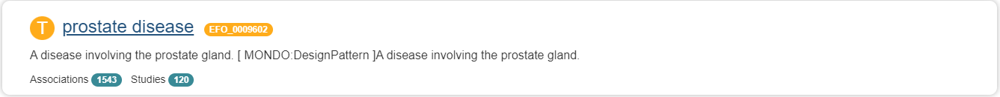

Clicking through on your trait of interest will reveal a substantial amount of interesting data about that trait, and *scrolling down* a bit will reveal the option to download CSV tables of both the associations and studies hosted on the GWAS catalog.

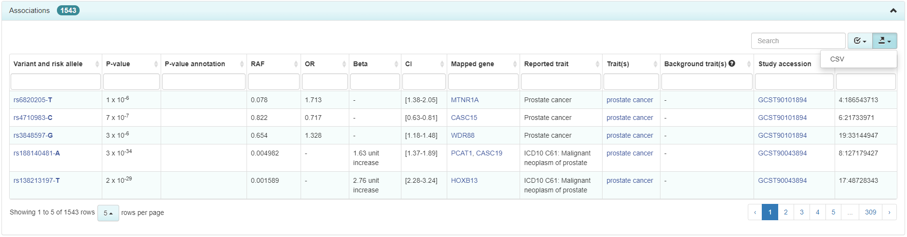
     *The above image shows the CSV drop-down option for downloading a table of interest in the top right corner of the image*

It is suggested that both association and studies tables are downloaded for completeness of local data, however, only the associations table is required for the package to function as intended. After downloading the tables for the traits which interest you, store the CSVs in their own folder somewhere on your computer--I suggest creating a new folder for this data and storing it inside of your R package for convenience. **It is critical that the folder contain ONLY association and studies tables for the** `createMT()` **call to function properly**. 

After downloading the tables for a trait of interest from the GWAS catalog you are ready to move into R and begin use of the package. 
```{r echo=FALSE}
#TODO: Verify the above statement about only needing assocations to be true after modifying createMT() 
#TODO: after getting the package working for the new data you brought in, rewrite the folder name to GWAS.data again.. as of right now the document reads a bit clunky otherwise. 
```
## Grabbing Data from Ensembl 

This step assumes you already have the package downloaded and installed, if you do not, then go over to the [README](https://github.com/J-T-Nelson/GWASpops.pheno2geno) and follow the installation instructions.

Assuming you have stored your GWAS catalog tables in a folder named "exampleData/air_pollution" within your working project directory, to get started using the package you would first use 'createMT()' in order to do 1 of 3 different but related actions.

*Most users will simply be using the 3rd option which is a superset of the first 2 options, as the 3rd option is the only one which will grab population allele data.* 

1. Pull GWAS catalog data into R as a data.table which automatically merges the associations and studies tables within GWAS.data into a single master table
2. Do 1. then automatically call Ensembl API Variants endpoint for further data on the SNPs found in the associations table, this additional data will also be merged into the master table. 
3. Do 1. and 2. but also request population allele frequency data from the same Ensembl endpoint, this will result in a list being returned which contains the aforementioned master table as well as two lists of tables, each list representing a different organizational scheme for the population frequency data. 
```{r eval=FALSE}
library(GWASpops.pheno2geno)

# option 1
masterTable_1 <- createMT('./exampleData/air_pollution', varAnnotations = FALSE)

# option 2, varAnnotations is TRUE be default and thus we simply don't alter its state. 
masterTable_2 <- createMT('./exampleData/air_pollution')

# option 3, population_data is FALSE by default; this option requests substantially more data which results in relatively long wait times for the funtion to resolve. See the help page with ?createMT to learn more about why this call may fail when population_data is activated. 
masterTable_3 <- createMT('./exampleData/air_pollution', population_data = TRUE)
```

```{r echo=FALSE}
# TODO: substitute './exampleData/air_pollution' for './GWAS.data' after debugging!
# TODO: figure out how to show the tables you have created with these calls in the document and display them such that a new user would quickly grasp what is happening 
# TODO: before working out how to represent R objects within Rmd, I need to debug my function such that it actually runs for this larger data set... Additionally, I think the pipeline is going to need some further work in order to overcome all the issues that are certain to occur with larger data sets and thus larger requests from Ensembls API ... 
#    - thinking that I will need to cache successful calls somehow and use those un-transformed lists as checkpoints whenever a call fails such that the function automatically works its way through failed API calls when calling for 100s or 1000s of rsIDs 
```

```{r echo=FALSE}
#library(knitr)
#library(GWASpops.pheno2geno)
#kable(GWAS.asso.study.data[1:5], caption = "masterTable_1")
## ^^ the kable printout of this table is really unusable so I am going to just take screen shots instead. 
```

#### Screen Shots of Data Associated with Each Option

##### Option 1: 
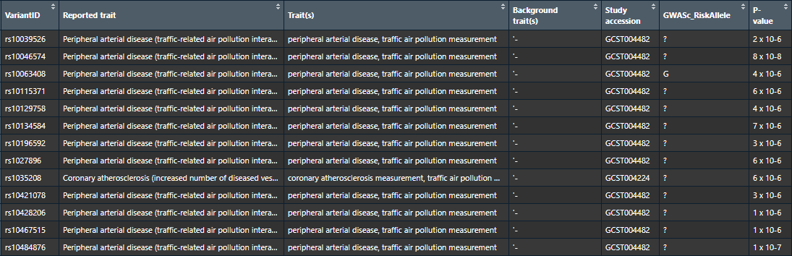
*Image is a small portion of the table for, there are many more variables and observations within the object*


##### Option 2: 
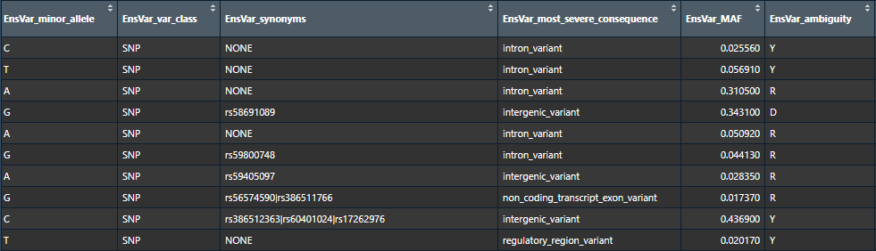
*Emphasizing the additional columns added by hitting Ensembl API for variants data, they all share a common prefix "EnsVar"*

##### Option 3: 
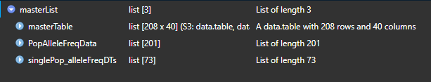

*Note in the above image the structure of the data created by `createMT()`, the first object in the list is the masterTable generated by option 2. The other two objects are both lists of data tables which as mentioned before are alternative perspectives on the same data. `PopAlleleFreqData` has a table per allele. `singlePop_alleleFreqDTs` has a table per population*
\ 

Now that you have gotten the data into R, you can begin using it to generate visualizations for data exploration, or if you would like to store the data you can export any number of tables within a list into individual CSVs using `write_csv_listOf_DFs()`.

## Using The Aggregated Data: 


Now that data has been retrieved and transformed we can move onto visualizing the population frequency data with either of two provided functions. 

1. **graph_varPopFrequencies()** focuses on a single SNP and graphs many populations with respect to that SNP such that populations low or high in a particular SNP can be easily identified.

2. **graph_singlePopAlleleFreq()** instead focuses on a single population and will graph many SNPs for a selected population which can reveal if SNPs associated with some phenotype are generally high or low in a given population. 

**Importantly** I will not go into extensive detail about the optional arguments which can be used to create a variety of different graphs in this tutorial, as *users can simply type `?graph_singlePopAlleleFreq` into the R console to bring up manual pages within R studio, where details on each function are fully documented. 

*Users familiar with R and its plotting capabilities may prefer to create their own graphs at this point, however, for those users who lack experience these two flexible wrapper functions are provided which can expedite the process of visual data exploration.*

### graph_varPopFrequencies() Demo: 


```{r eval=F}
library(GWASpops.pheno2geno)
masterList <- testMasterList
interestingSNP <- masterList[[2]][[10]] #picking a SNP which I am interested in


# Graph 1:
graph_varPopFrequencies(interestingSNP)

# Graph 2:
graph_varPopFrequencies(interestingSNP, ascending = T , yUpperLim = .25)

interestingSNP2 <- masterList[[2]][[23]] #picking a different SNP of interest

# Graph 3:
graph_varPopFrequencies(interestingSNP2, ascending = T , yUpperLim = .25, graph_style = 'point')


```

**Graph 1**
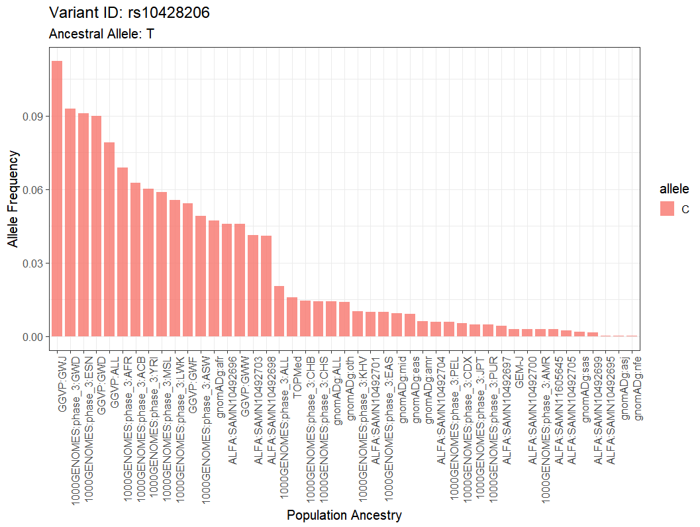

**Graph 2**
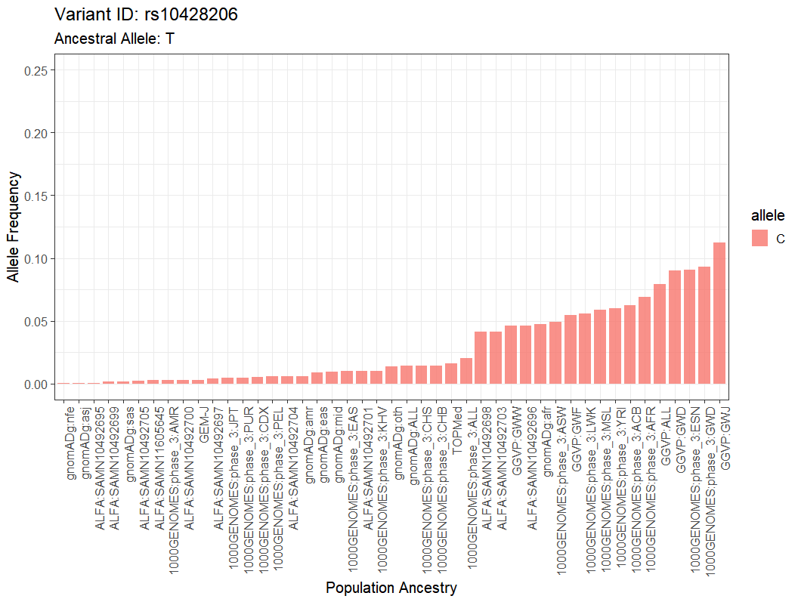

**Graph 3**
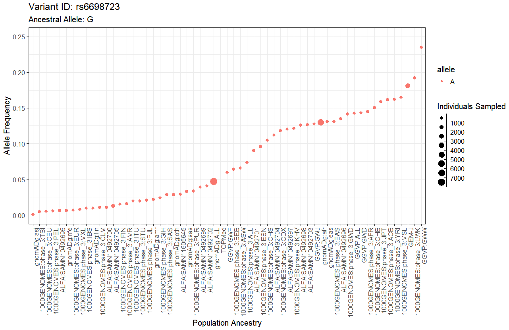


### graph_singlePopAlleleFreq() Demo: 


```{r eval=F}
library(GWASpops.pheno2geno)

# preloaded within the package is an object called testMasterList (made from `createMT()`)  
# which is made up from the GWAS catalog tables which can be found from several pages 
# related to 'air pollution' traits 
masterList <- testMasterList
all1Kgenomes <- masterList[[3]][[1]]

#Graph 4:
graph_singlePopAlleleFreq(masterList[[1]], all1Kgenomes)

# Graph 5: 
graph_singlePopAlleleFreq(masterList[[1]], all1kGenomes, numVariants = 10, graph_style = 'bar', orderless = T)

# Graph 6: 
graph_singlePopAlleleFreq(masterList[[1]], all1kGenomes, facet_graph = T, pValAsSize = T, orderless = T)
```
**Graph 4**
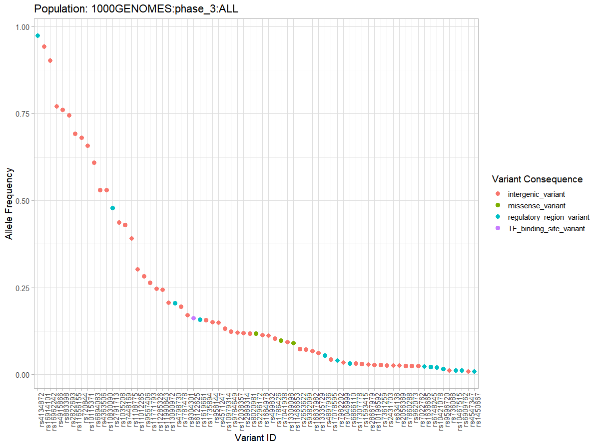

**Graph 5**
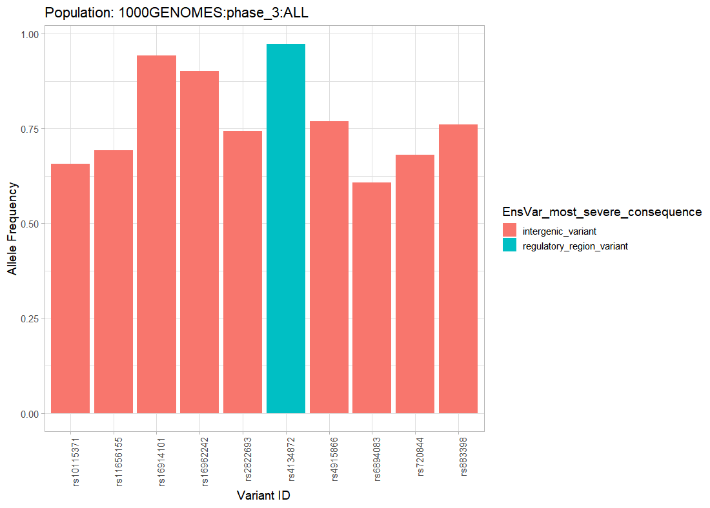

**Graph 6**
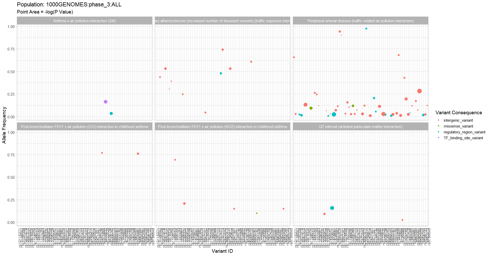
*This last graph may be difficult to see, though I wanted to show some of variance in graphs which can be produced by this function, as different options allow the user to learn about otherwise hidden aspects of their data visually.*


### Writing Tables to CSVs

While the action of writing tables to CSVs in R is trivial for experienced users, I created a simple function to help newer users with this task. 

Here is a quick example of how to use `write_csv_listOf_DFs()`. I am using dummy data which is built into R to demonstrate this function, as any list of tables is a suitable object for `write_csv_listOf_DFs()`. 
```{r Exporting_Flat_Files, eval=FALSE}
# attaching GWASpops.pheno2geno 
library(GWASpops.pheno2geno)

# Creating list of data.frames, `trees` is a data set which is automatically built into most R downloads. 
A <- trees 
dummyList <- list()
for(i in 1:10){
  dummyList[[i]] <- A
}

#setting valid names for the tables in the list, these names can easily be set to numbers as well, 
#however having no name at all OR, having invalid characters within the names can cause the function to fail. 
names(dummyList) <- LETTERS[1:10]

#writing our data frames to a specified location. One CSV is produced per table within 'dummyList'
write_csv_listOf_DFs(dummyList, destinationFolder = './dummy')
```

As you can see this will generate csv files within the specified folder, I used numbered names as well, which is the laziest and easiest ways to get flat file versions of the data tables created by this package. 

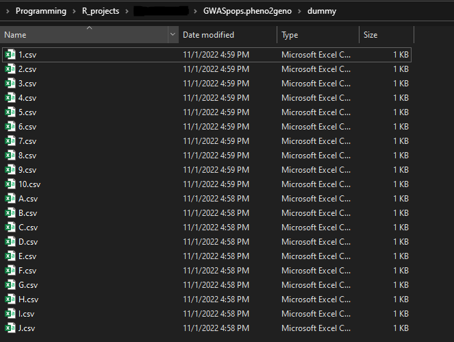


## Premade Data Objects

There are 3 data objects which may be useful. 

1. `Populations` 

Populations table is the most important of the included data objects as it includes the expanded forms of the terms which are used for each population that can be graphed by `graph_singlePopAlleleFreq()`, thus this table can help you understand exactly what populations you're looking at in a graph, and also will help you identify which populations interest you most depending on what research questions you have in mind. See `?Populations` to read more about this data object or to find the source used to create the table. 

2. `testMasterList`
See `?testMasterList` to learn more. 

3. `GWAS.asso.study.data`
see `?GWAS.asso.study.data` to learn more. 


## Known Errors, Warnings and Limitations

Some issues have arisen in testing this package which have not been resolved, either because they are not critical to the packages use, or because they are considered edge-cases which aren't worth development time currently. If your issue does not show up here, please reach out to me at *jon.tanner.nelson@temple.edu* with relevant details and I will try to get back to you about it and update documentation ASAP. 

### Errors: 

1. **When plotting large data sets with `save = TRUE` for `graph_singlePopAlleleFreq()`** 

> Error in seq_len(n) : argument must be coercible to non-negative integer 

*This error occurred consistently when plotting my largest 4 test data sets. I consider it minor, as there are several options for getting a plot exported beyond the build in option in the function and otherwise the graphing function works without issue on these data sets.*

2. **When using `createMT()` to grab data from Ensembl via API calls**

> 1. Error in get(helpTopicsName, envir = .rs.toolsEnv()) :
      object '.completions.helpTopics' not found
      
> 2. Error in curl::curl_fetch_memory(url, handle = handle) :
      Operation was aborted by an application callback
    
*These errors are unrelated to the package itself and instead a failing of the functions used to call the Ensembl API for data retrieval* TO FIX: Simply attempt your `createMT()` call again. These errors were not encountered frequently in development of the package. 

### Warnings: 

Currently many warnings are produced by various calls throughout the package, they are to be investigated when time/resources permit but have not been perceived to damage core package function as it stands and thus are a relatively low priority. Most if not all warnings encountered have to do with discarding incomplete data automatically as I understand them. 

> EXAMPLES: Warning message:
              Expected 2 pieces. Additional pieces discarded in 18 rows [203, 675, 676, 690, 691, 692, 693, 694, 695, 696, 925, 926, 927, 928, 929, 930, 954, 955].

### Limitations

**The pipeline has not been tested against all data from the GWAS catalog/Ensembl and thus is prone to have issues when novel data fields are introduced by untested data sets. The core transformation function responsible for converting nested-lists into flat tables may fail is these cases.** The pipeline at this point has been tested against 11 distinct data sets associated with 11 distinct search terms in the GWAS catalog. See `./exampleData` contents to see the tested data sets for yourself. 

In the case you find a data set you're quite interested in which is unsuccessfully transformed you can try the `processData = FALSE` option for `createMT()` which will result in your GWAS data being imported into a list and used to retrieve annotation and population data from Ensembl, but the data will not be transformed into flat tables. From this point you can either attempt to manually work with the data from there or use the `ensListTransform()` function on the untransformed data. (`ensListTransform()` is the function called within `createMT()` when `processData = TRUE`).
