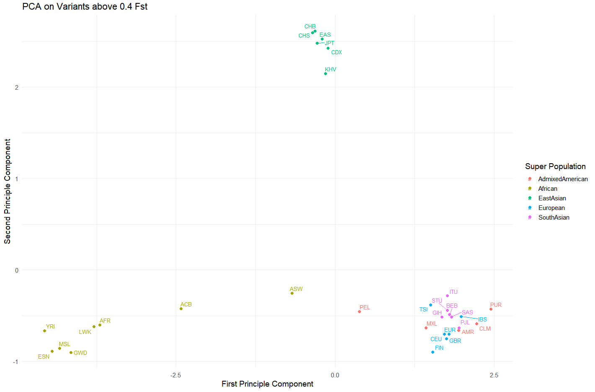

## Visulaizations


### PCA

#### Unique SNPs per Parent Term: 

| Cancer     | Cardiovascular disease | Digestive System Disorder | Immune System Disorder | Metabolic Disorder | Neurological Disorder | Other Disease | Total |
|:------------:|:------------:|:------------:|:------------:|:------------:|:------------:|:------------:|:------------:|
| 66 | 51 | 75 | 74 | 18 | 162 | 105 | 477 |





### Number SNPs above Fst Thresholds per Sub Population

#### All Diseases: 


##### Monogenic Diseases: 


### Prevalence Vs Mean Allele Frequency

**CRITICAL NOTE ON THESE PLOTS:** 

Unfortunately these plots were not able to be configured as I desired. For unknown reasons the row order was not able to be changed, and due to time constraints I wasn't able to resolve this issue before generating the plots. Further the GBR sub population within the "mean-allele-frequency" bar graphs is evidently incorrect. Some error in preprocessing occurred with this sub population which can be seen in these graphs, thus the GBR population comparison here should be ignored. 

#### Correlation Table


#### Bar Plots: 


### Top 20 SNPs (by Fst) Per Super Population 

#### Admixed American


#### African


#### East Asian 


#### South Asian


#### European 


## Tables


**NOTE: All tables will be displayed partially here and can be downloaded for complete viewing from the "tables_(csv)" folder**

### 


#### Top 20 Disease SNPs per Sub Population

```{r, echo=FALSE, layout="l-body-outset"}
load("./workingData/top20_disease_vars_perPop_with_fst.rds")
library(knitr)
kable(head(t20_disease_with_fst))
```


#### Top 10 Monogenic Disease SNPs per Sub Population


```{r, echo=FALSE, layout="l-body-outset"}
load("./workingData/top10_monogenic_vars_perPop_with_fst.rds")
library(knitr)
kable(head(t10_mono_with_fst))
```


#### Complete Set of Monogenic Disease Associated Variants

```{r, echo=FALSE, layout="l-body-outset"}
load("./workingData/monogenic_variants_complete.rds")
library(knitr)
kable(head(monogenic_variants_complete))
```


## R Version & Packages Used

### Version: 
                               
platform       x86_64-w64-mingw32               
arch           x86_64                           
os             mingw32                          
crt            ucrt                             
system         x86_64, mingw32                  
status                                          
major          4                                
minor          2.1                              
year           2022                             
month          06                               
day            23                               
svn rev        82513                            
language       R                                
version.string R version 4.2.1 (2022-06-23 ucrt)
nickname       Funny-Looking Kid         


### Packages: 

**Package**       **Version**

curl                4.3.2

data.table         1.14.2

dplyr              1.0.10

esquisse            1.1.2

ggplot2             3.3.6

ggrepel             0.9.3

httr                1.4.4

jsonlite            1.8.0

knitr               1.40

purrr               0.3.4

tibble              3.1.8

tidyr               1.2.1

GWASpops.pheno2geno 0.900


